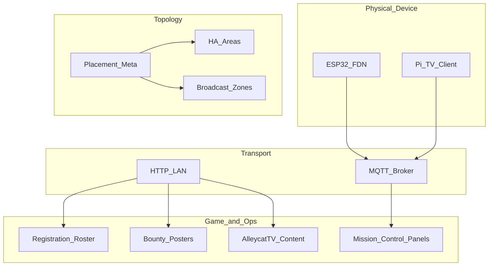

# Mission Control — Design Principles Audit

**Date:** 2026-09-13  
**Scope:** Read-only architecture audit of Mission Control and related services  
**Status:** Findings only — no remediation committed

## Scope

| Area | Path |
|------|------|
| HA package / glue | `HomeAssistConfig/Config/` |
| Digital Node Nexus | `HomeAssistConfig/digital_node_nexus/` |
| Registration | `HomeAssistConfig/registration/` |
| AlleycatTV | `HomeAssistConfig/ProjectAlleycatTV/` |
| Bounty | `HomeAssistConfig/ProjectBounty/` |
| Player API stub | `ProjectMissionControl/player_api_stub/` |

**Out of scope for this pass:** remediation PRs, new system-of-record map, Rust Central implementation.

**Scoring stance:** Infer intended authority from code and docs. Flag every place truth is duplicated, reconstructed, or compensated. Do not invent a replacement authority map here — that is the next decision meeting.

**Severity:** high / med / low  
**Labels:** **Aligned** · **Tension** · **Violation**

---

## 1. Executive hotspots

Cross-cutting issues that violate multiple principles and should drive the decision meeting:

| # | Hotspot | Severity | Primary principles |
|---|---------|----------|--------------------|
| H1 | **Roster split-brain** — Registration integration, REST sensors, Bounty HTTP client, Photobooth, and `player_api_stub` each fetch “players” with different URLs, paths, and shapes | high | P1, P2, P5, P6 |
| H2 | **Role encoding triple** — `role` / `hunter` / `mode` normalized independently in ≥4 places | high | P2, P5, P7, P8 |
| H3 | **Create-player drops game fields** — POST sends only `name`+`email`; update sends role/allegiance; UI reconstructs later | high | P1, P2, P5 |
| H4 | **LED color fiction** — commands carry RGB; status reports on/off; HA light hardcodes white; zone sync assumes real color | high | P2, P4, P5, P6 |
| H5 | **AlleycatTV zone membership unused** — server stores `pi_ids`; runtime authority is Pi env `ZONE_ID` | high | P1, P2, P3 |
| H6 | **Dual MQTT command publishers** — HA integration and AlleycatTV server both publish the same topics; no ack | high | P1, P2, P6 |
| H7 | **Two topologies** — HA Areas (physical) vs AlleycatTV broadcast zones (content); placement meta owned per-integration | high | P1, P3, P8 |
| H8 | **Poster identity split** — Bounty stores player fields, overlays Registration on HTML, returns store snapshot on API; `/api/players/{id}` is poster-shaped | high | P1, P2, P9 |
| H9 | **Cross-domain HTTP from feature UIs** — DNN fetches AlleycatTV zones; Registration panel talks Bounty directly | med | P3, P8, P9 |
| H10 | **Implicit presence / playback state** — online via LWT heuristics; playback as string + parallel booleans; no desired-vs-actual | med | P4, P6 |

---

## 2. Findings by design principle

### P1 — Ownership follows responsibility

> Store information only where decisions are made.

| Status | Finding | Sev | Evidence |
|--------|---------|-----|----------|
| **Violation** | Zone membership decided on the Pi (`ZONE_ID` env) but also modeled on the server as `Zone.pi_ids` (written via CRUD, never used for routing) | high | `ProjectAlleycatTV/client/.../config.py`; `server/app/models.py` (`pi_ids`); grep shows `pi_ids` only in model + `docs/setup.md` |
| **Violation** | FDN `broadcast_zone` decided/stored in DNN HA `device_meta`, not on the device that executes LED behavior | high | `digital_node_nexus/.../__init__.py` `_set_placement` |
| **Violation** | Bounty stores player identity fields it does not decide; Registration is the live decision-maker for name/role/allegiance | high | `ProjectBounty/.../posters.py` `_apply_live_overlay` |
| **Tension** | AlleycatTV HA placement (`area_id`) stored in integration Store while media decisions use Pi-reported `zone` | med | `alleycattv/.../__init__.py` `_set_placement`; `media_player.py` `_zone_id()` |
| **Aligned** | AlleycatTV server owns playlist/media files; Pis pull playlists over HTTP | — | `server/app/routers/playlists.py`, Pi `playlist_manager.py` |

---

### P2 — Prefer authority over consensus

> If an authoritative source exists, use it instead of reconstructing truth everywhere.

| Status | Finding | Sev | Evidence |
|--------|---------|-----|----------|
| **Violation** | Multiple roster authorities: Registration `PlayerApi` (`GET /players`), `Config/rest.yaml` → `player_api_players_url` (`/api/players`), Bounty `registration_client` (probes both shapes), Photobooth hardcoded Render URL, `player_api_stub` | high | `registration/.../__init__.py`; `Config/rest.yaml` + `secrets.yaml`; `ProjectBounty/.../registration_client.py`; `AAA-Photobooth/network.js`; `player_api_stub` |
| **Violation** | Role reconstructed from `role` ∥ `hunter` ∥ `mode` in registration update map, bounty panel, bounty server, stub | high | `role_to_hunter` in registration `__init__.py`; `_norm_role` / `_playerRole` in Bounty |
| **Violation** | LED RGB commanded but never authoritative in HA — `rgb_color` property always `(255, 255, 255)` | high | `digital_node_nexus/.../light.py` lines 77–79; `StatusMsg.led_state` only in proto |
| **Violation** | Dual MQTT command authorities for AlleycatTV (HA + server) | high | `server/app/mqtt_client.py` docstring lines 3–5; HA `__init__.py` services publish |
| **Violation** | Poster HTML uses live Registration overlay; `GET .../by-player` and `/api/players/{id}` return stored snapshot without overlay | high | `posters.py` `_render_poster` vs `get_poster_by_player` |
| **Tension** | Registration config entry can point “online” while REST sensors stay locked to LAN stub URL in secrets | med | `Config/secrets.yaml` (`player_api_base` DigitalOcean vs `player_api_*_url` `192.168.1.234`) |
| **Aligned** | DNN treats device MQTT status (when present) as source for telemetry fields | — | `handle_status_message` in DNN `__init__.py` |

---

### P3 — Separate layers rigorously

> Physical device interactions, topology, transport, and game logic should remain distinct.

| Status | Finding | Sev | Evidence |
|--------|---------|-----|----------|
| **Violation** | DNN (device integration) HTTP-fetches AlleycatTV zone directory with hardcoded fallback IP | med | `_fetch_alleycattv_zones` fallback `http://192.168.1.144` |
| **Violation** | Registration panel fetches Bounty posters/videos over HTTP (roster UI knows poster transport + LAN URL) | med | `registration/www/.../registration-panel.js` bounty base URL / fetch helpers |
| **Tension** | AlleycatTV HA integration combines MQTT control, placement Store, device registry, and full content HTTP proxy | med | `alleycattv/__init__.py` + `http.py` |
| **Tension** | Pi `player.py` owns mpv, webpage, interrupt resume, playlist index, MQTT status, cache publish | med | `client/alleycattv_player/player.py` |
| **Tension** | Topology attributes (`broadcast_zone`) copied onto every DNN entity | low–med | `light.py` / `sensor.py` / `binary_sensor.py` `extra_state_attributes` |
| **Aligned** | MQTT for edge telemetry/commands vs HTTP for roster/content APIs is a coherent transport split in intent | — | DNN/AlleycatTV MQTT; Registration/Bounty/AlleycatTV content HTTP |

---

### P4 — Represent state explicitly

> Prefer clear, well-defined state machines over emergent or derived state.

| Status | Finding | Sev | Evidence |
|--------|---------|-----|----------|
| **Violation** | FDN online is heuristic: empty LWT → offline; successful decode **forces** `online: True` (ignores `status.online`); no `stale`/`unknown` | med | DNN `__init__.py` `handle_status_message` ~320–355 |
| **Violation** | AlleycatTV playback: proto string states plus `_interrupted`, bumper, webpage, timers — ad-hoc transitions | med | `client/.../player.py` command/interrupt/end-file paths |
| **Violation** | No desired-vs-actual for LED or TV commands — publish and hope status arrives | med | DNN/AlleycatTV service publish-only paths |
| **Tension** | Light “color state” in HA is derived fiction (always white), not reported state | high (also P2) | `light.py` `rgb_color` |
| **Aligned** | Proto documents intended playback states (`playing|paused|stopped|interrupted|idle`) — machine not enforced in code | — | `alleycattv.proto` / player usage |

---

### P5 — Propagate truth instead of rediscovering it

> If one component knows the answer, communicate it.

| Status | Finding | Sev | Evidence |
|--------|---------|-----|----------|
| **Violation** | Create-player accepts role/allegiance in API signature/WS but does not POST them — truth discarded at the boundary | high | `register_player` form_body only `name`, `email` |
| **Violation** | Zone directory rediscovered by DNN HTTP scrape instead of consuming AlleycatTV integration / shared client | med | `_fetch_alleycattv_zones` |
| **Violation** | Role normalization reimplemented wherever a player object appears | high | Registration, Bounty panel, Bounty server, stub, Photobooth `hunter` filter |
| **Tension** | Pi publishes both protobuf status and JSON mirror; HA accepts either — dual encodings of same truth | med | `mqtt_handler.py` `publish_status` |
| **Tension** | Panel device/player caches rebuild from WS + events + sensors in parallel | low–med | DNN/Registration panel JS + `hass.data` + REST sensors |
| **Aligned** | Retained MQTT status + LWT empty payload is a “propagate offline” pattern (when LWT fires) | — | Firmware LWT; HA empty-payload handler |

---

### P6 — Remove root causes, not symptoms

> When systems compensate for other systems, question aggressively.

| Status | Finding | Sev | Evidence |
|--------|---------|-----|----------|
| **Violation** | `broadcast_zone_light_sync` automation: global `state_changed` fan-out, peer `light.turn_on`, echo risk; shipped `initial_state: false` as human gate | med | `Config/automations.yaml` |
| **Violation** | Dual command publishers + no ack → any “reconcile” would be compensating for missing single control plane | high | AlleycatTV mqtt_client + HA services |
| **Violation** | REST roster/health pollers run beside the Registration integration — parallel truth as compensation for not sharing active URL | high | `Config/rest.yaml` vs integration |
| **Tension** | Cache delete/purge REST returns success after MQTT publish; `devices.json` updates only when Pi next reports | med | `server/app/routers/devices.py` |
| **Tension** | Pi infinite playlist-fetch retry at boot; periodic refresh — soft reconcile for server availability | med | `player.py` / playlist manager |
| **Tension** | Registration online/local mode is explicit failover, but REST secrets do not follow the same decision | med | Registration panel `set_server` vs `secrets.yaml` |
| **Aligned** | Firmware MQTT/WiFi reconnect loops are transport-level (appropriate layer) | — | ESP32 firmware / Pi paho |

---

### P7 — Optimize for human understanding

> Complexity paid by developers is as real as complexity paid by CPUs.

| Status | Finding | Sev | Evidence |
|--------|---------|-----|----------|
| **Violation** | Three names for one player attribute (`role`/`hunter`/`mode`) force every consumer to coalesce | high | Cross-project (see P2) |
| **Violation** | Docs/overview language implies LED **color** is HA state; runtime cannot round-trip color | low–med | Presentation docs vs `light.py` / `StatusMsg` |
| **Tension** | Dual panel trees (`registration/www` vs `Config/www`, bounty similarly) — copy/junction drift risk | low | Package README install layout |
| **Tension** | DNN config collects `topic_prefix` but topics hardcoded `esp32/…` | low | DNN config flow vs subscribe topics |
| **Tension** | Hardcoded LAN IPs and `localStorage` URL overrides beside HA secrets/config entries | med | DNN zone fallback; Registration/Bounty panels |
| **Aligned** | Custom sidebar panels give operators a domain vocabulary (Registration, DNN, AlleycatTV, Bounty) | — | `configuration.yaml` `panel_custom` |

---

### P8 — Build reusable primitives

> General capabilities belong in shared infrastructure, not feature-specific managers.

| Status | Finding | Sev | Evidence |
|--------|---------|-----|----------|
| **Violation** | Placement reinvented: DNN (`area` + `broadcast_zone` meta) and AlleycatTV (`area` meta only) — no shared venue placement service | high | Both integrations’ `_set_placement` |
| **Violation** | Player registry client reinvented: HA WS, Bounty HTTP probe, Photobooth fetch, stub contract | high | See H1 |
| **Violation** | Role normalization not a shared library/schema | high | See H2 |
| **Tension** | Per-integration `list_areas` websocket wrappers around HA area registry | low | DNN / AlleycatTV WS commands |
| **Tension** | AlleycatTV content HTTP proxy in HA could be a generic authenticated reverse-proxy primitive; Bounty panel goes direct instead | med | `alleycattv/http.py` vs bounty panel fetch |
| **Tension** | No shared command-bus / presence primitive — each edge stack rolls its own MQTT wrapper | med | DNN, AlleycatTV server, Pi, HA mqtt component |
| **Aligned** | Protobuf schemas exist as shared contracts for FDN and AlleycatTV commands/status (copies still drift-prone) | — | `*.proto` + generated bindings |

---

### P9 — Use the minimum necessary scope of knowledge

> Local first, global only when required.

| Status | Finding | Sev | Evidence |
|--------|---------|-----|----------|
| **Violation** | Bounty exposes `GET /api/players/{player_id}` returning `PosterPublic` — poster store pretending to be player API | high | `posters.py` lines 221–224 |
| **Violation** | DNN knows AlleycatTV HTTP paths and default IP | med | `_fetch_alleycattv_zones` |
| **Violation** | Registration UI knows Bounty URL shapes and media endpoints | med | registration-panel bounty helpers |
| **Tension** | Media player entity for one Pi issues **zone-wide** play/stop/volume | med | `alleycattv/media_player.py` |
| **Tension** | Firmware/client defaults embed WiFi/MQTT credentials and broker IPs | med | ESP32 firmware; Pi `config.py` |
| **Aligned** | Pi playlist fetch scoped to its `ZONE_ID`; does not need global zone directory at runtime | — | `playlist_manager.py` |
| **Aligned** | Bounty intake MAC→player left as 501 stub rather than inventing a fake global resolver | low | intake router (intentional unfinished) |

---

## 3. Findings by system

### 3.1 Digital Node Nexus (FDN)

**Role today:** MQTT bridge + sidebar for ESP32 venue nodes; placement meta in HA Store.

| ID | Finding | Sev | Principles |
|----|---------|-----|------------|
| DNN-1 | LED RGB not in `StatusMsg`; HA light always reports white | high | P2, P4, P5 |
| DNN-2 | Placement (`area_id`, `broadcast_zone`) owned in HA meta; device unaware of zone | high | P1, P3 |
| DNN-3 | Fetches AlleycatTV zones over HTTP + hardcoded fallback | med | P3, P8, P9 |
| DNN-4 | Online forced true on any non-LWT decode; no staleness | med | P4 |
| DNN-5 | Commands fire-and-forget (qos=1 publish, no ack/desired state) | med | P4, P6 |
| DNN-6 | Area meta → registry one-way; HA UI area edit can fork from meta | med | P1, P2 |
| DNN-7 | `topic_prefix` config unused | low | P7 |

**Aligned:** Push-based MQTT status into entities; services for message/LED/haptic/raw; LWT empty payload offline signal.

---

### 3.2 AlleycatTV

**Role today:** Content server (playlists/media), Pi players, HA live panel + content proxy.

| ID | Finding | Sev | Principles |
|----|---------|-----|------------|
| TV-1 | `zones.pi_ids` unused; runtime membership = Pi `ZONE_ID` env | high | P1, P2 |
| TV-2 | HA + server both publish MQTT commands | high | P1, P2, P6 |
| TV-3 | Physical HA area placement ≠ broadcast/content zone | high | P1, P3 |
| TV-4 | Playback FSM implicit (flags + string) | med | P4 |
| TV-5 | Device online/playback only in HA; cache inventory only in server `devices.json` | med | P2, P8 |
| TV-6 | Cache MQTT cmds return success without Pi ack | med | P6 |
| TV-7 | Zones/playlists independent JSON stores (no FK/cascade) | med | P1 |
| TV-8 | Protobuf + JSON dual status channels; triple proto copies | low–med | P5, P7 |
| TV-9 | Per-Pi media_player controls whole zone | med | P9 |

**Aligned:** Server as playlist/media authority; Pi pulls content; retained MQTT status for operator view.

---

### 3.3 Registration

**Role today:** HA integration + panel over Player API (online or local); intended roster façade for Mission Control.

| ID | Finding | Sev | Principles |
|----|---------|-----|------------|
| REG-1 | `register_player` drops role/allegiance/faction/neo_id on create | high | P1, P2, P5 |
| REG-2 | `role`↔`hunter` mapping on update; panel coalesces `mode\|\|role\|\|hunter` | high | P2, P7 |
| REG-3 | Competing REST sensors in Config with different base URL than integration | high | P2, P6 |
| REG-4 | Panel reaches into Bounty HTTP | med | P3, P9 |
| REG-5 | Config entry vs YAML vs secrets — multiple URL authorities | med | P1, P7 |
| REG-6 | Unused `STORAGE_KEY` cache constant — abandoned local layer | low | P6, P7 |

**Aligned:** Explicit online/local mode switch (operator-owned failover); WS commands for panel; refresh list after writes.

---

### 3.4 ProjectBounty

**Role today:** Poster media + flavor presentation; should consume Registration for identity.

| ID | Finding | Sev | Principles |
|----|---------|-----|------------|
| BTY-1 | Snapshot fields in store + live overlay on HTML only | high | P1, P2, P5 |
| BTY-2 | `/api/players/{id}` returns poster, not player | high | P2, P9 |
| BTY-3 | Role/allegiance normalization duplicated (panel, server, client) | med | P8 |
| BTY-4 | Active playlist ephemeral in `app.state` — game “who is active” on Bounty | med | P1, P3 |
| BTY-5 | Photobooth uses separate Render URL + `hunter` int filter | med | P2, P8 |
| BTY-6 | HA integration mostly URL config; panel also uses localStorage/hardcoded IP | med | P7, P9 |
| BTY-7 | Intake MAC→player 501 stub | low | (intentional) |

**Aligned:** Bounty owns poster media files and presentation flavor; HTML overlay pattern acknowledges Registration as live identity (incomplete application to APIs).

---

### 3.5 Config / HA glue

| ID | Finding | Sev | Principles |
|----|---------|-----|------------|
| CFG-1 | `rest.yaml` roster/health parallel to Registration integration; secrets LAN vs DO mismatch | high | P2, P6 |
| CFG-2 | Zone LED sync automation compensates for missing shared lighting primitive; disabled by default | med | P6, P8 |
| CFG-3 | `rest_commands.yaml` hardcodes default LAN base for player API | med | P7 |
| CFG-4 | Deployed `www/` copies vs source trees under each project | low | P7 |

---

### 3.6 player_api_stub

| ID | Finding | Sev | Principles |
|----|---------|-----|------------|
| STUB-1 | In-memory parallel Central with dual `role`+`hunter`; list shape `{ data: [...] }` | med | P2, P8 |
| STUB-2 | Accepts create fields Registration client does not send — contract asymmetry | med | P5 |
| STUB-3 | No persistence / no MAC intake — fine for stub, dangerous if treated as prod peer | low–med | P1 |

**Aligned:** Explicit interim contract until Rust Central; documented bind on `:8090`.

---

## 4. Authority inventory (as implemented today)

| Domain | Who writes | Who reads | Competing / shadow sources |
|--------|------------|-----------|----------------------------|
| FDN telemetry (rssi, ip, led on/off, …) | ESP32 → MQTT retained status | DNN → entities/panel | None primary; stale retained possible |
| FDN LED RGB / brightness command | HA services/panel → MQTT `LedCmd` | Firmware applies | HA entity RGB **not** authoritative |
| FDN placement (area, broadcast_zone) | DNN panel/service → HA Store (+ area registry) | Entities, automation, panel | HA UI area edits can diverge from Store |
| Pi broadcast zone membership | Pi env `ZONE_ID` | MQTT status, zone cmd sub | Server `zones.pi_ids` (unused) |
| Pi physical placement (HA area) | AlleycatTV HA Store | Panel / registry | Independent of content zone |
| Playlist / media content | AlleycatTV server JSON + files | Pis via HTTP | Pi env photo/bumper defaults as fallback |
| Playback / Pi online | Pi MQTT (+ LWT) | HA only | Server does not consume playback status |
| Pi cache inventory | Pi → MQTT cache status | Server `devices.json` / Content Manager | Not mirrored as HA entities |
| TV commands | **HA MQTT and/or server MQTT** | Pi | Dual publishers |
| Player roster | External Player API / stub | Registration integration, REST sensors, Bounty client, Photobooth | Multiple URLs/paths/shapes |
| Player role | API fields (inconsistent) | Everyone coalesces | `role` / `hunter` / `mode` |
| Poster media | Bounty store + files | Poster HTML, APIs, panels | FS filename heuristics vs JSON |
| Poster identity display | Registration (HTML overlay) vs Bounty store (API) | Depends on endpoint | Split brain by consumer |
| Active kiosk players | Game → Bounty `active_playlist` | Kiosk JS | Ephemeral; not Registration |

---

## 5. Compensating-mechanism inventory (P6 lens)

| Mechanism | Where | Reads as |
|-----------|-------|----------|
| Firmware/Pi MQTT & WiFi reconnect | Edge devices | Legitimate transport retry |
| LWT empty payload | FDN / Pi → HA | Legitimate presence signal (incomplete without staleness) |
| Status republish ~30s retained | FDN firmware | Soft refresh; no HA TTL policy |
| Re-`list_players` after write | Registration `PlayerApi` | Cache refresh, not conflict merge |
| REST `scan_interval` roster/health | `Config/rest.yaml` | **Parallel authority** — symptom of not sharing active URL |
| Automation `initial_state: false` | Zone LED sync | Human-gated compensate for unsafe sync |
| Registration online/local mode | Panel / config entry | Explicit failover; undermined by fixed REST secrets |
| Infinite playlist fetch retry | Pi boot | Compensates for server not ready / discovery gaps |
| Cache cmd “success” without ack | AlleycatTV devices API | Optimistic lie — symptom of missing command lifecycle |
| Live overlay on posters only | Bounty HTML | Compensates for storing identity Bounty does not own |
| Panel `mode \|\| role \|\| hunter` | Registration / Bounty JS | Compensates for schema fragmentation |

---

## 6. Shared-primitive candidates (observation only)

Not a remediation plan — candidates the decision meeting should name owners for:

1. **Player registry client** — one list/by-id/by-mac contract + single role schema  
2. **Venue placement** — device ↔ HA Area ↔ broadcast zone assignment  
3. **Zone directory** — one owner (AlleycatTV server); thin clients elsewhere  
4. **Command bus** — single publisher path + ack/desired-vs-actual for edge devices  
5. **Presence** — explicit `unknown | online | offline | stale` from last_seen + LWT  
6. **Service URL resolution** — one place for LAN/cloud bases (no panel hardcodes / secret forks)

---

## 7. Open questions for the decision meeting

These are intentionally unanswered by this audit:

1. **Who is system of record for the player roster** once Rust Central exists — and what should happen to REST sensors, Photobooth, and the stub?
2. **Single role schema:** retire `hunter` int, `mode`, or both? Who publishes the canonical enum?
3. **Zone membership:** is authority the Pi, the AlleycatTV server (`pi_ids`), Registration/Mission Control assignment, or something else?
4. **Is HA a mirror or an authority** for live device state (LED color, online, playback)? If mirror, which fields must round-trip from devices?
5. **Placement model:** one topology or two (physical area vs content zone)? If two, which component is allowed to join them?
6. **Command plane for AlleycatTV:** HA-only, server-only, or server-as-gateway with HA calling HTTP?
7. **Bounty’s relationship to identity:** store `player_id` only and always fetch live fields, or own a frozen “poster edition” snapshot by design?
8. **Which compensating mechanisms are temporary scaffolding** vs permanent product (online/local mode, REST pollers, disabled LED sync)?

---

## 8. Explicit non-goals of this document

- No ranked remediation backlog  
- No target architecture prescription  
- No “fix these files next” implementation sequence  
- No changes to runtime behavior

**Next step after team review:** a separate decision pass that answers §7, then a remediation plan that removes root causes rather than adding more sync.

---

## 9. Evidence index (high-severity anchors)

| Claim | Anchor |
|-------|--------|
| Create drops fields | `registration/custom_components/registration/__init__.py` — `register_player` POST body `name`/`email` only |
| Update sends role+hunter | same file — `update_player` `role_to_hunter` |
| REST vs integration roster URLs | `Config/secrets.yaml` — DO `player_api_base` vs LAN `player_api_players_url` |
| LED RGB hardcoded | `digital_node_nexus/.../light.py` — `rgb_color` → `(255, 255, 255)` |
| Status has no RGB | `digital_node_nexus.proto` — `StatusMsg.led_state`; `LedCmd` has r/g/b |
| Online forced true | DNN `__init__.py` — device dict `"online": True` after decode |
| Zone fetch + fallback IP | DNN `__init__.py` — `_fetch_alleycattv_zones` |
| `pi_ids` unused at runtime | `models.py` + setup docs only; Pi uses `ZONE_ID` |
| Dual MQTT publishers | `ProjectAlleycatTV/server/app/mqtt_client.py` docstring |
| Poster overlay vs API | `ProjectBounty/.../posters.py` — `_apply_live_overlay` / `get_poster_by_player` / `/api/players/{id}` |
| Photobooth separate roster | `ProjectBounty/AAA-Photobooth/network.js` — Render `/api/players` + `hunter` filter |
| Stub dual encoding | `player_api_stub/src/main.rs` — `hunter` + `role` |
| LED sync automation disabled | `Config/automations.yaml` — `initial_state: false` |
